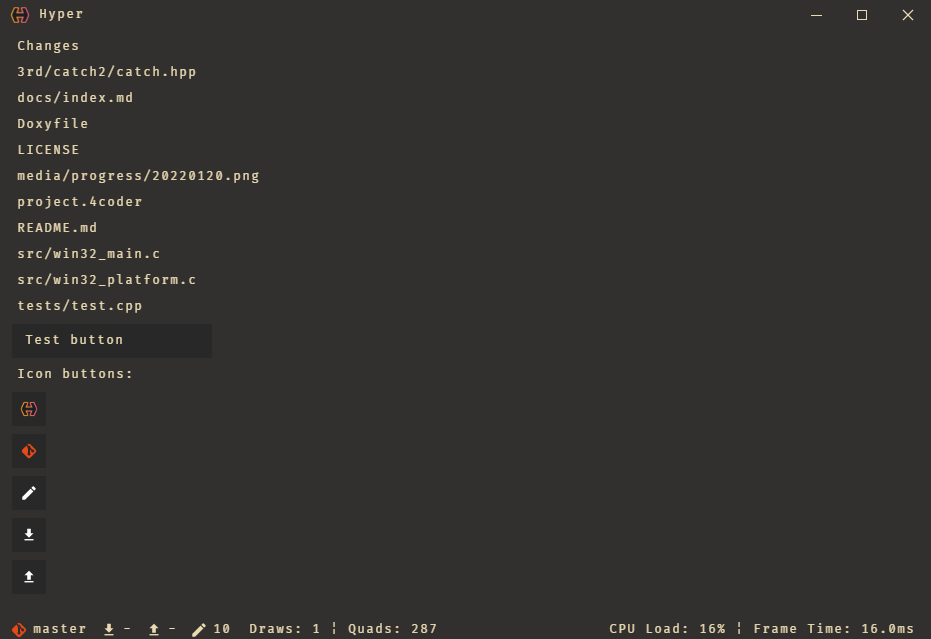

# win32-opengl-batch2d-test [](https://github.com/alexandru-cazacu/HyperEngine/blob/master/LICENSE)

> **⚠ WARNING: This project was a test.**

This repo contains a simple 2d batch renderer prototype made in C and OpenGL with some dependencies.



Features:

- Simple 2d batch renderer made with OpenGL
- Borderless window with custom border (no interaction, just graphics)
- Windows Icon

# Building from source

## Windows 

`cl` should be available in `PATH`. Search `Developer Command Prompt from VS 2019` and launch it. Use that terminal or run `./shell_win-x64.bat`. Then run one of the build scripts:

```shell
./build-debug.bat
./build-release.bat
./build-tests.bat
```

After that the relative binary will be generated

```
./bin/Win-x64-Debug/Hyped.exe
./bin/Win-x64-Release/Hyped.exe
./bin/Win-x64-Tests/Hyped.exe
```

If you have `4coder` the process is quite simple. Just use one of the function keys.

| Key | Action        |
| --- | ------------- |
| F1  | Build Debug   |
| F2  | Run Debug     |
| F3  | Build Release |
| F4  | Run Release   |
| F7  | Generate Docs |

# License

This project is available under the permissive MIT license. For more info check the [LICENSE](https://github.com/alexandru-cazacu/win32-opengl-batch2d-test/blob/master/LICENSE).
